## Introduction

I recently spent three days in Prague, and I’d love to share my experience — from the routes I followed to the places I ate and the hidden gems I discovered along the way.

A big thanks to Eleonora Ongaro’s guide for helping me shape this trip! [^eo] 🙏

All the photos here are my own, taken during the trip.

---

## 🗓 My 3-Day Itinerary

### Day 1: A Rainy Start at the National Museum

The first day was rainy, so I focused on one main highlight:

- **National Museum (Národní Muzeum)** – a huge and fascinating museum with a variety of exhibits:
  - *Natural History*: animals, fossils, minerals;
  - *Czech History*: from ancient Bohemia to modern times;
  - *Music & Arts*: instruments and cultural artifacts;
  - *Temporary Exhibitions*: different aspects of Czech culture.

  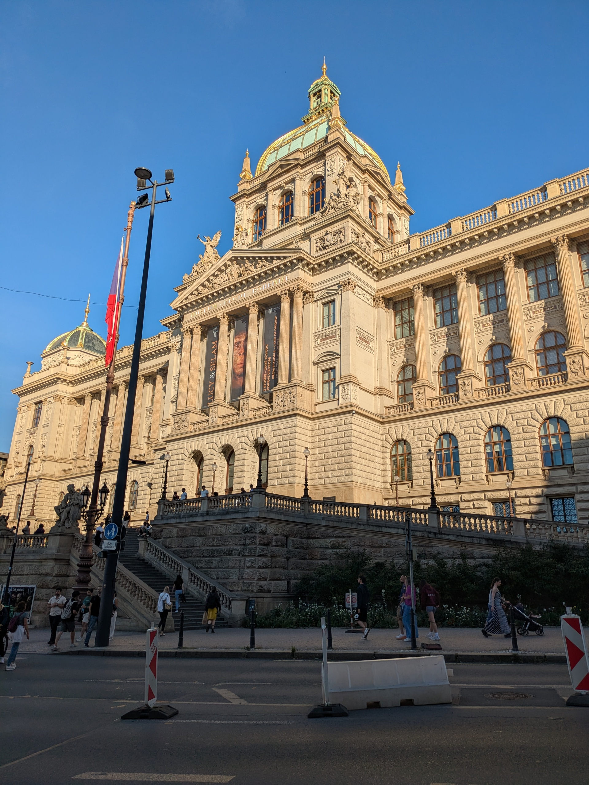

Even with the rain, visiting the museum was the perfect introduction to Prague’s culture and history.

---

### Day 2: The Classic Prague Experience

**Morning: Iconic Landmarks**

- **Astronomical Clock (Orloj)** – on the Old Town Hall. Every hour, the "Walk of the Apostles" shows twelve apostle figures moving above the clock. Climbed the tower for a **panoramic view of Old Town Square**.

    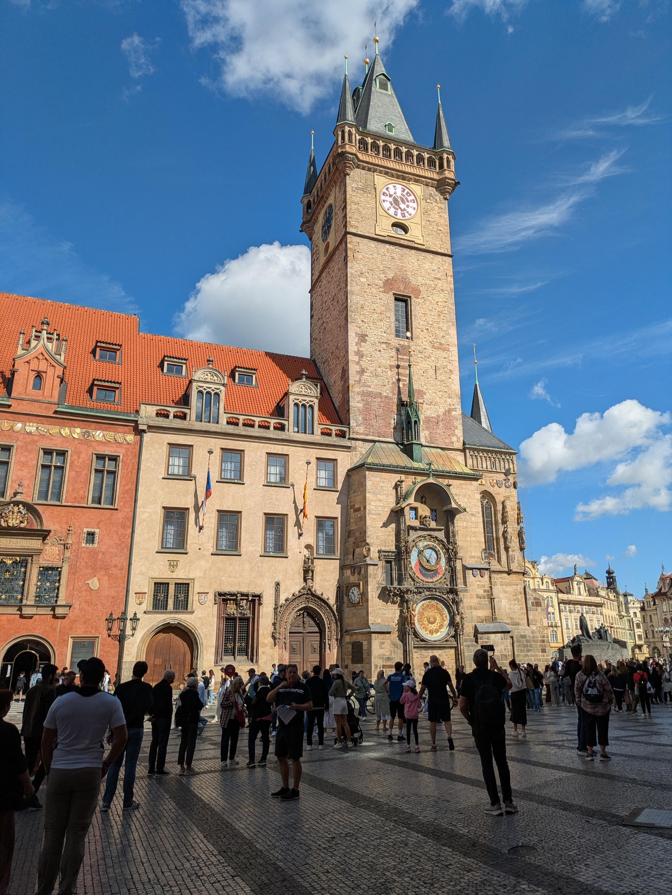

- **Old Town Square & Local Markets** – colorful baroque buildings and lively markets selling crafts and foods. 

  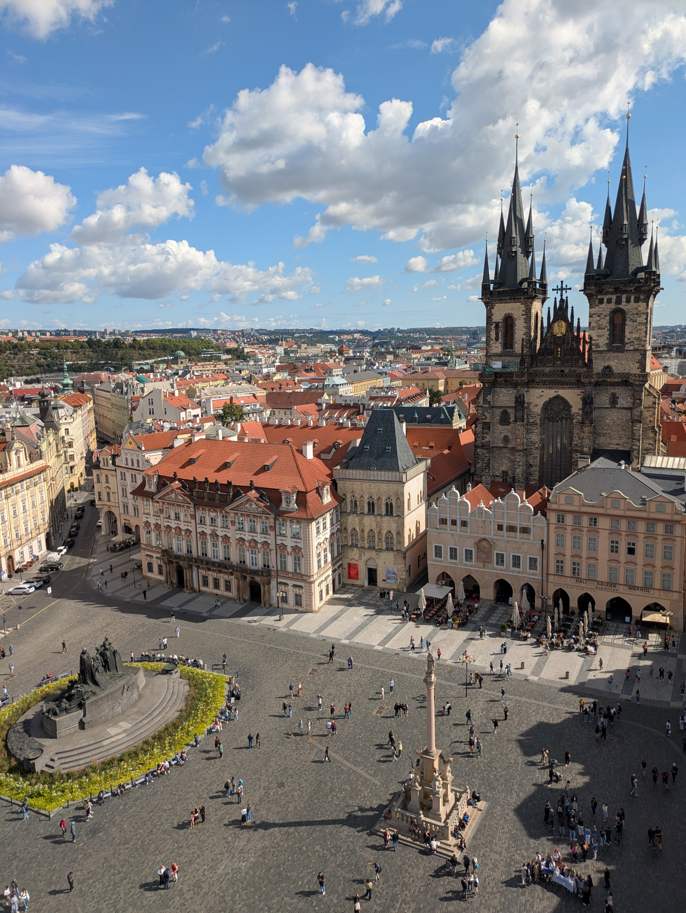

    One of the markets to check out is **Havelský Market**, a historic open-air market with stalls full of fresh fruits, vegetables and local handicrafts, right between Old Town Square and Wenceslas Square.

- **Charles Bridge (Karlův most)** – a 14th-century stone bridge connecting Old Town to Malá Strana, lined with 30 statues of saints. 

  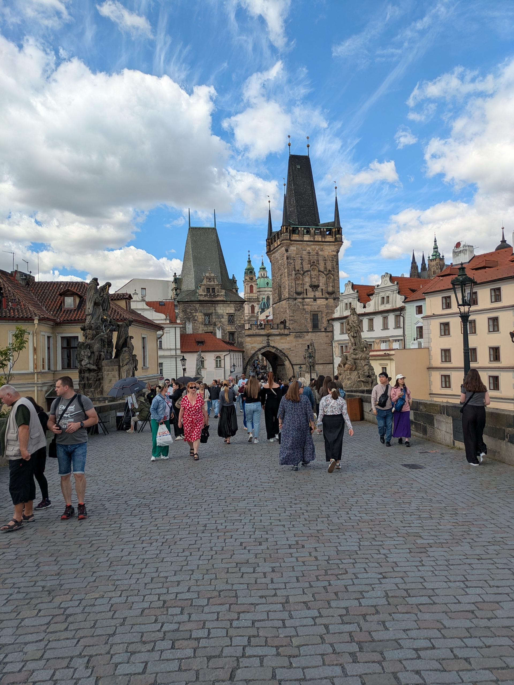

  Walking across at sunset was magical, even if it was crowded — the views of the river and the city were worth it.

**Afternoon: Castle and Brewery Tour**

- **Prague Castle Complex (Pražský hrad)** – I was expecting a castle, but it’s actually a huge complex of palaces, churches, and courtyards.

  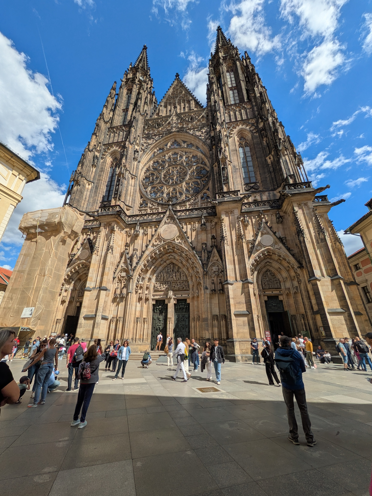

    The scale and architecture alone show why it’s been the seat of kings and presidents for centuries.

- **Pilsner Urquell Experience** 🍺 – guided tour of the Pilsner Urquell museum in Prague to learn about the famous beer originally from Plzeň. The guided tour offered interesting insights into how the first pale lager was created, along with tastings.

  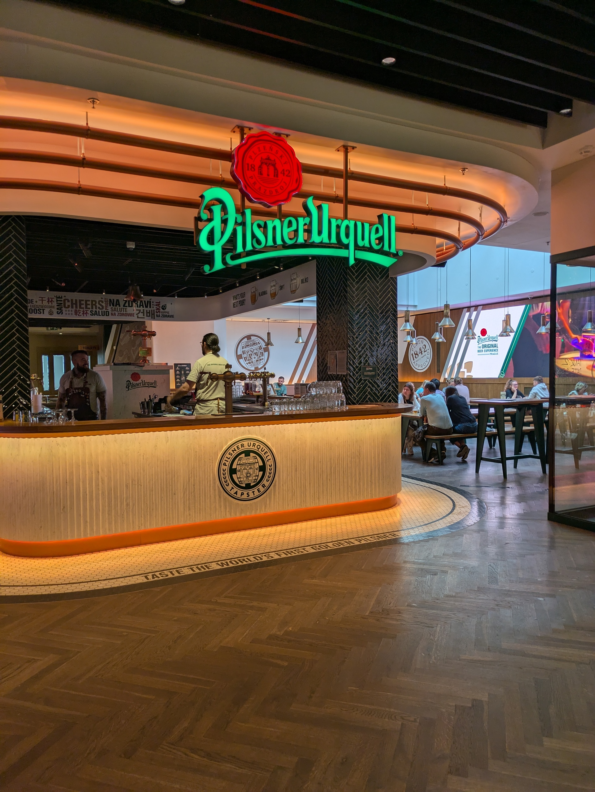

    It’s very tourist-friendly, but still fun and worth it if you enjoy beer.

---

### Day 3: Modern Art and Green Views

**Morning: Contemporary Prague**

- **Sigmund Freud Statue** – a quirky sculpture by David Černý. It’s a life-size figure of Freud hanging by one hand above Husova Street. I wasn’t particularly impressed, but it definitely stands out.

- **Franz Kafka’s Head** – an 11-meter kinetic sculpture made of rotating steel layers. It’s supposed to rotate for 15 minutes at the start of every hour, but when I visited I went back three times to see it move… no luck! Maybe it was broken, or at least that’s what the bartender at the shop nearby told me. 

- **Dancing House (Fred & Ginger)** – a modern architectural icon by Frank Gehry. Very touristy, and personally I wasn’t that impressed, though it is striking against Prague’s historic skyline.

  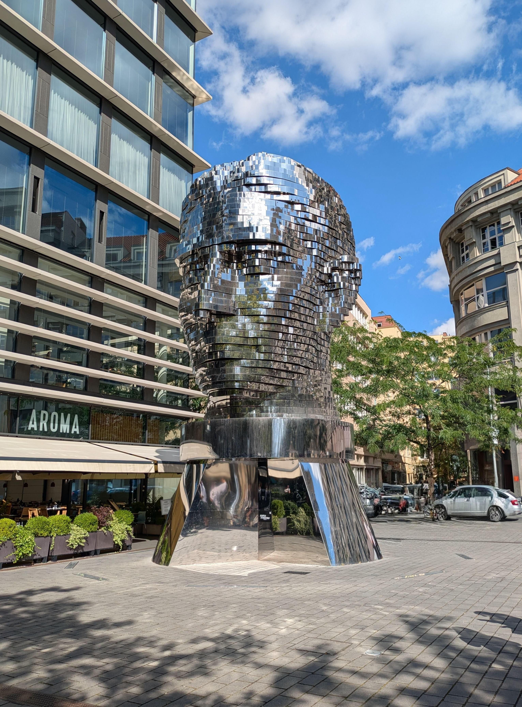

**Afternoon: Green Prague** 🌿

- **Petřín Hill & Observation Tower** 🗼 – the climb up the "mini Eiffel Tower" (63.5 m) was a bit nerve-wracking, but the glass-enclosed platform made it safe. Luckily, there was no wind, and the view over Prague was stunning.

- **Klementinum Library** – we tried to visit the famous baroque library, but the line was way too long.

  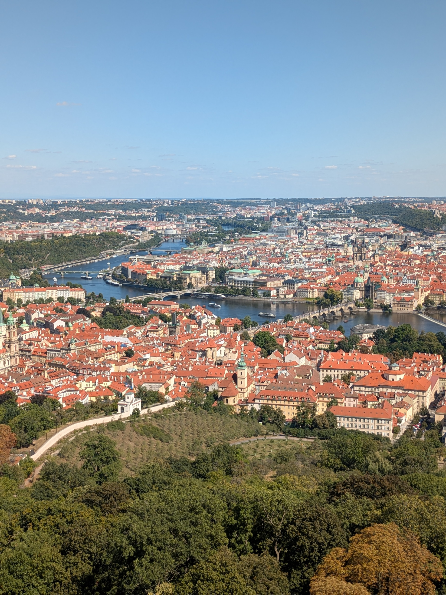

---

## 🍻 Culinary Highlights & Breweries

All food and brewery experiences in one place for easier reading.

### Traditional Czech Food

- **Cheese Soup** – it came served inside a hollowed-out loaf of bread, with the soup poured right in. A cheesy, filling dish that felt super cozy on a chilly evening.

  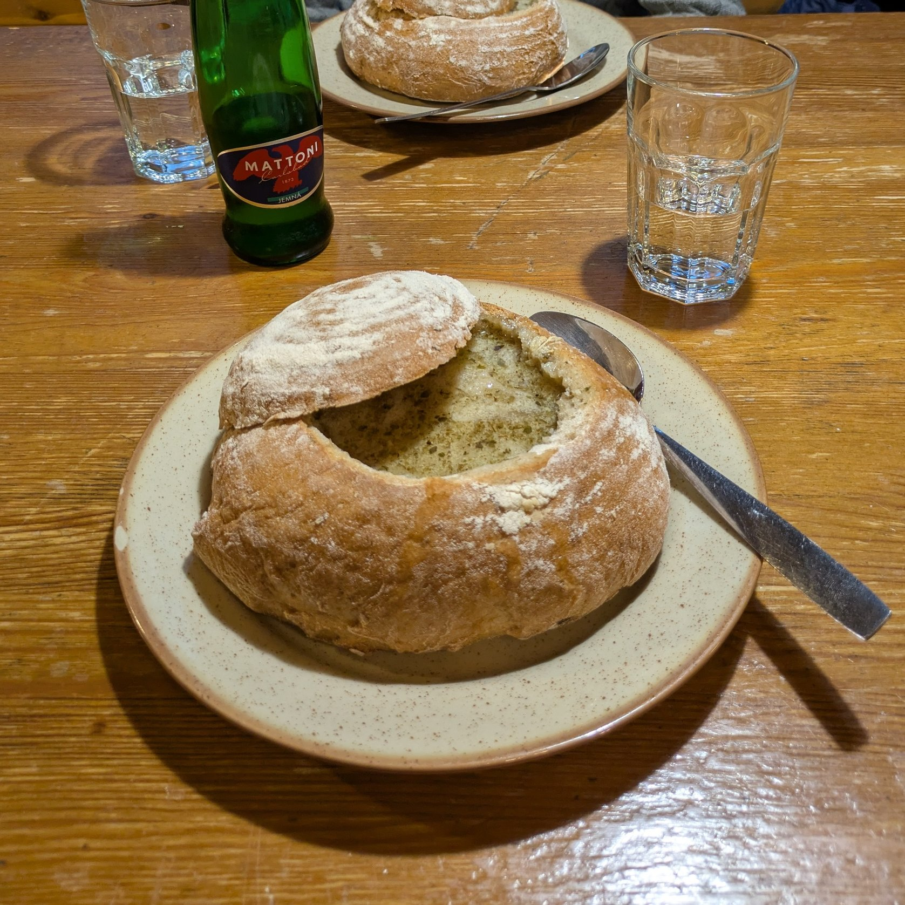

- **Pastrami Melt** – Pastrami is a hearty cured and smoked beef, typically served warm with dumplings and sauerkraut.

  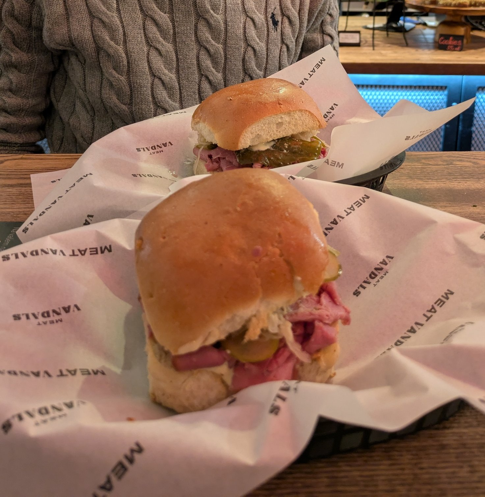
  
  I tried it in a sandwich, packed with sauerkraut — simple but so good. The smoky beef with the tangy kraut was exactly what I needed after walking around the city all day.

### Breweries Worth Visiting

- **U Fleků** – historic brewery founded in 1499, famous for its dark lager. 

  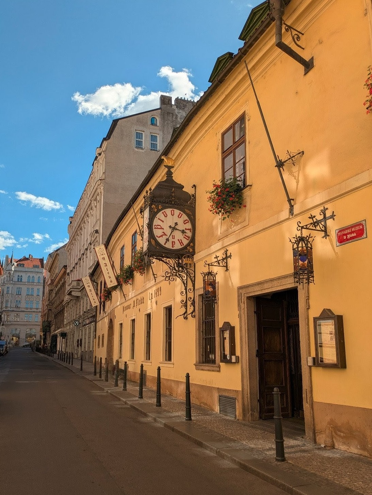

  The dark lager was excellent — smooth and easy to drink. I even enjoyed it more than the classic pilsner.

---
## ✨ Final Thoughts

Prague was magical. It rained only on the first day, but after that the weather was perfect, letting me see everything I wanted!

It’s a beautiful city, easy to explore on foot in just a couple of days. Beyond the famous architecture and tourist spots, there’s fascinating beer history and little surprises around every corner.

[^eo]: [Eleonora Ongaro – Prague in 3 Days](https://www.eleonoraongaro.it/cosa-vedere-a-praga-in-3-giorni/)

